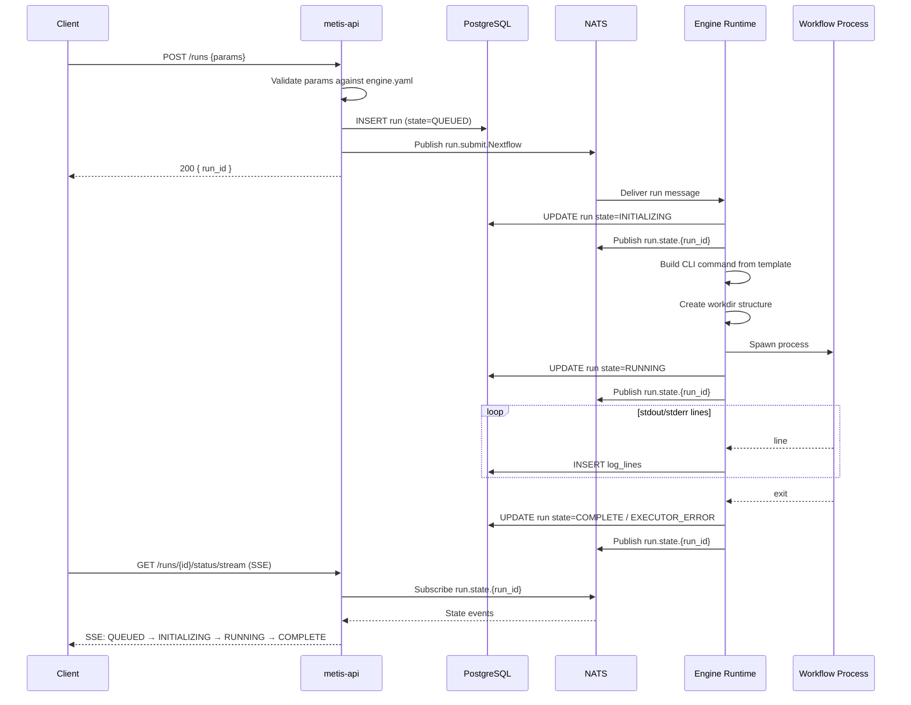
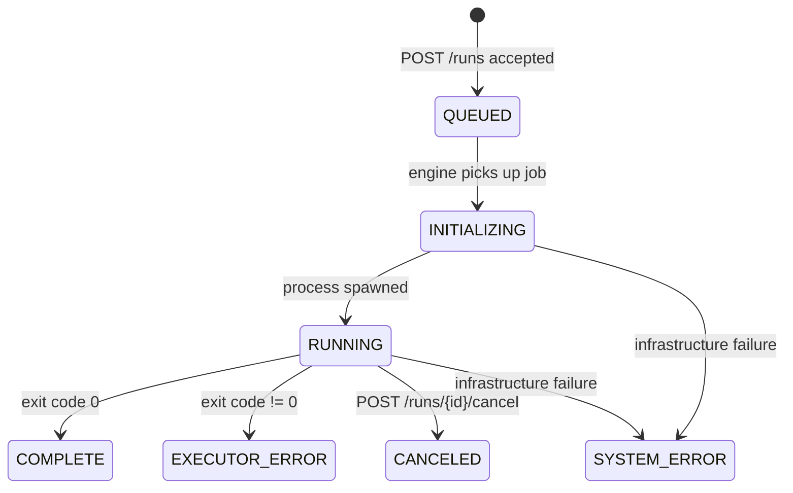

# Architecture

## Overview

Metis is built around three decoupled layers connected by a message bus. The HTTP API never executes workflows; execution happens entirely in isolated engine processes that communicate asynchronously via NATS.

```mermaid
graph LR
    Client -->|HTTP REST / SSE| API

    subgraph Core Infrastructure
        API[metis-api]
        NATS[NATS]
        PG[(PostgreSQL)]
        VK[(Valkey)]
    end

    subgraph Engine Runtime
        ER[metis-engine-generic]
        WF[Workflow Process\nnextflow / snakemake / ...]
    end

    API -->|INSERT run| PG
    API -->|publish run.submit.{engine}| NATS
    API -->|read state/logs| PG
    API -->|check heartbeat| VK

    NATS -->|subscribe run.submit.{engine}| ER
    ER -->|spawn| WF
    WF -->|stdout/stderr| ER
    ER -->|INSERT log_lines| PG
    ER -->|UPDATE run state| PG
    ER -->|publish run.state.{run_id}| NATS
    ER -->|register PID| VK

    API -->|subscribe run.state.{run_id}| NATS
```

## Components

### metis-api

The HTTP layer. Responsibilities:

- Validate incoming `POST /runs` against engine config (parameter types, allowed values, denied flags)
- Persist run record to PostgreSQL
- Publish run submission to NATS topic `run.submit.<engine_name>`
- Serve paginated logs and current state from PostgreSQL
- Serve SSE streams for real-time status and log updates
- Handle cancellation by reading the PID from Valkey and sending SIGTERM

The API is stateless beyond database connections. Multiple replicas can run behind a load balancer.

### NATS

The async message bus. Decouples run submission from execution so that:

- The API returns immediately after persisting the run
- Engine processes can be restarted without losing queued work
- Multiple engine types subscribe to separate topics (`run.submit.Nextflow`, `run.submit.Snakemake`, etc.)

NATS is also used for the real-time status SSE stream: the engine publishes state transitions and the API relays them to connected clients.

### Engine Runtime (`metis-engine-generic`)

The execution layer. A single binary that:

1. Subscribes to the `run.submit.<engine_name>` NATS topic
2. Reads `engine.yaml` on startup to build its configuration
3. On receiving a run message:

- Builds the CLI command from `commandTemplate`, substituting validated parameters
- Creates the working directory tree
- Spawns the workflow subprocess
- Captures stdout/stderr line-by-line and writes to `log_lines`
- Tracks state transitions and publishes them to NATS
- Registers the process PID in Valkey for cancellation

Engines implement the `Engine` trait to provide engine-specific result parsing and task log extraction:

```rust
pub trait Engine: Send + Sync {
    fn new() -> Self;
    async fn get_workflow_results() -> Result<HashMap<Category, Files>>;
    async fn get_task_logs() -> Result<Vec<TaskLog>>;
}
```

Everything else — NATS subscription, process execution, log capture, state transitions — is handled by the shared runtime.

### PostgreSQL

Persistent state. Four tables:

| Table | Contents |
| ----- | -------- |
| `runs` | Run metadata: state, workflow URL/params, engine, timestamps, tags |
| `run_logs` | Aggregate run-level log: exit code, stdout/stderr summary, command |
| `log_lines` | Individual streamed output lines indexed by `(run_id, stream, seq)` |
| `task_logs` | Per-task execution records (for engines that report task-level data) |

Runs are soft-deleted (`deleted_at`) rather than hard-deleted.

### Valkey (Redis-compatible)

Ephemeral runtime data:

- **Engine heartbeats** — each engine instance writes a heartbeat; the API reads this to report available engines in `/service-info`
- **PID map** — `run_id → PID` so the API can send SIGTERM on cancel without knowing which engine node holds the process

## Run Lifecycle

End-to-end flow from client submission to completion:



## Run States



Terminal states: `COMPLETE`, `EXECUTOR_ERROR`, `CANCELED`, `SYSTEM_ERROR`

## Crate Structure

See [Engine Internals](/dev/engine) for the crate breakdown and how to add a custom engine.
