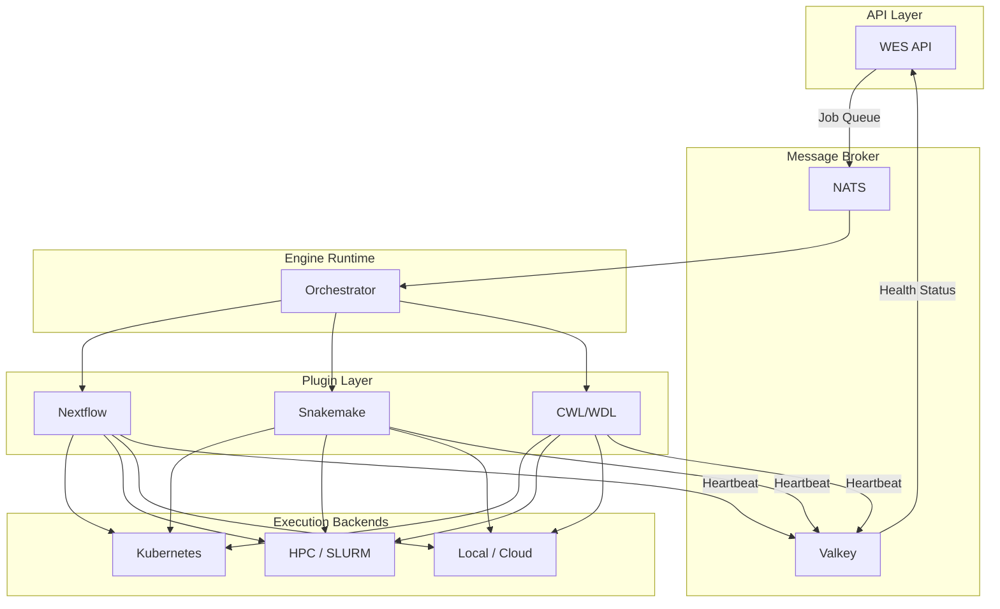

# Introduction to Metis

<div align="center">
  
</div>

::: warning Development Status
Metis is under active development. The docs may lag behind the current
implementation and behavior.
:::

## What is Metis?

Metis is a **WES 1.1.0 compliant** workflow execution service written
in **Rust** for memory safety, fearless concurrency, and high performance.
It orchestrates scientific and data-intensive workflows through a pluggable,
async-first architecture.

## Architecture

Metis is built around three decoupled layers with async messaging and health monitoring:



### Communication Patterns

| Channel | Purpose |
|---------|---------|
| **NATS** | Async job submission, status updates, log streaming |
| **Valkey** | Plugin heartbeats, execution state, health registry |

### Health Monitoring

Each plugin maintains a heartbeat in Valkey:

```text
plugin:nextflow:heartbeat → timestamp (TTL: 30s)
plugin:snakemake:heartbeat → timestamp (TTL: 30s)
```

If a heartbeat expires, the API marks that execution service as **unhealthy** and:

- Stops routing new jobs to that plugin
- Alerts operators via configured channels
- Optionally triggers plugin restart

### Execution Abstraction

Plugins delegate compute to execution backends:

```text
Plugin (Nextflow)
    │
    ├── KubernetesExecutor → K8s Jobs / Argo / Volcano
    ├── HPCExecutor        → SLURM / PBS / SGE
    ├── LocalExecutor      → Direct subprocess
    └── CloudExecutor      → AWS Batch / GCP Life Sciences
```

Same engine, different infrastructure - configured, not coded. This
is not directly handled by Metis and is a function of underlying
workflow engines support.

### Core Engine

The **engine crate** is the heart of Metis - a highly configurable process
manager that:

- **Validates** WES requests against engine-defined schemas
- **Builds** CLI commands from template configurations
- **Orchestrates** workflow lifecycle (staging → execution → cleanup)
- **Tracks** state through NATS pub/sub and Valkey storage

### Plugin System

Engines implement the `Engine` trait, defining how to:

1. Build execution commands from WES requests
2. Parse and return workflow results
3. Stream task logs

Adding a new engine requires only implementing this trait - no core
modifications needed.

### Configuration

All engine behavior is externalized to `engine.yaml`:

```yaml
engine:
  name: nextflow
  command_template: "nextflow run {workflow_path} {engine_params}"
  validation:
    workflow_type: [NEXTFLOW]
    required_params: [pipeline]
```

This template-driven approach enables zero-code customization of CLI building,
validation rules, and runtime behavior.

## Request Lifecycle

1. **Submit** → API receives WES request, publishes to NATS
2. **Validate** → Engine validates against configured schema
3. **Stage** → Working directory created, inputs resolved
4. **Execute** → CLI command built from template, subprocess spawned
5. **Track** → Status updates published, logs captured
6. **Complete** → Results returned via `get_workflow_results()`
