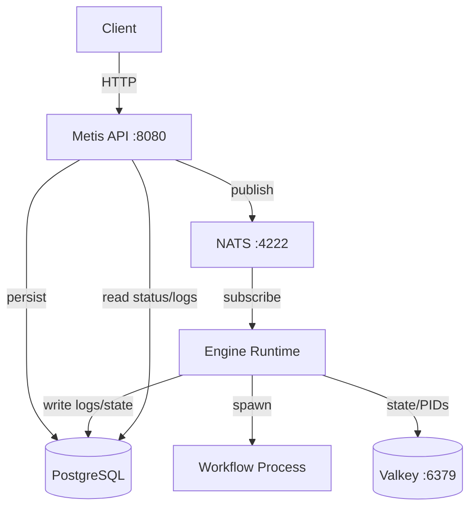

# Introduction to Metis

<div align="center">
  
</div>

::: warning Development Status
Metis is under active development. The docs may lag behind the current implementation.
:::

## What is Metis?

Metis is a **GA4GH WES 1.1.0** compliant Workflow Execution Service written in **Rust**. It provides a standardised HTTP API for submitting, monitoring, and cancelling workflow runs across any engine.

### Design Principles

- **Decoupled API and engine** — the HTTP layer never executes workflows. Submission and execution are separated by NATS.
- **Pluggable via trait** — adding a new engine requires implementing a single Rust trait, nothing in the core API changes.
- **Config-driven** — engine behaviour (command template, parameter validation, denied flags, workdir layout) is entirely controlled by `engine.yaml`. No code changes required for a new engine variant.
- **Spec compliant** — follows GA4GH WES 1.1.0 with extensions for SSE streaming and log pagination.

## Architecture Overview



Three decoupled layers:

| Layer | Component | Role |
| ----- | --------- | ---- |
| **HTTP** | `metis-api` | Validates requests, serves status/logs, handles cancellation |
| **Messaging** | NATS | Async job queue — decouples submission from execution |
| **Execution** | Engine Runtime | Builds CLI, spawns process, captures output, tracks state |

## Supported Workflow Engines

| Engine | Workflow Type | Versions |
| ------ | ------------- | -------- |
| Nextflow | `NFL` | DSL2 |
| *(extensible)* | any | via trait |

Any binary that can be invoked as a subprocess can be wrapped as a Metis engine — configure `commandTemplate` in `engine.yaml` and start `metis-engine-generic`.

## Run States

Runs follow the WES state machine:

```text
QUEUED → INITIALIZING → RUNNING → COMPLETE
                              ↘ EXECUTOR_ERROR
                              ↘ CANCELED
                              ↘ SYSTEM_ERROR
```

## Next Steps

- [Quick Start](/getting-started) — run Metis locally in minutes
- [Engine Configuration](/engine-configuration) — full `engine.yaml` reference
- [API Reference](/api-reference) — all endpoints
- [Architecture](/architecture) — deep dive into components and message flow
